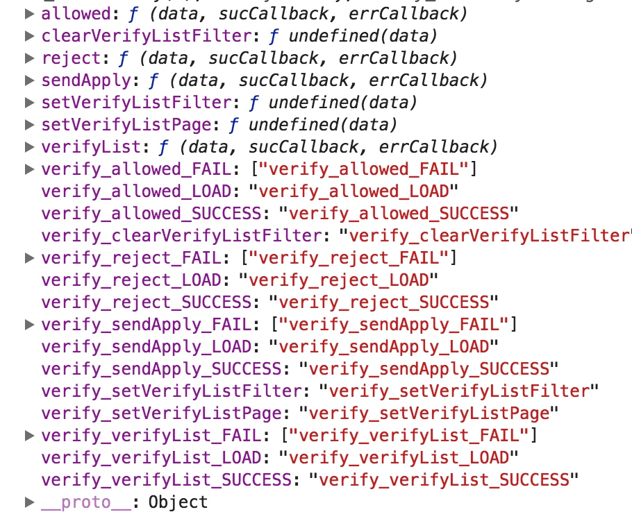

# 前言

  周二上午到达广州，下午到部门实习，这次的任务是基于原有的推送项目做一些需求增加。
  一开始还是很慌的，因为现有系统已经在公司内部跑了，因此压力还是很大的。不过好在导师开发的，带着我过了一遍，然后我也很尽力的死磕源码，边读边做笔记。然后晚上开始了解整个需求，导师将其进行分期分配，第二天就直接开始做需求了，因此是边做边学习的节奏，踩了不少坑，主要是不了解系统，而且用的技术栈是16年的，而且导师在那个时候设计的思想很超前，感觉学习价值很大，因此在周末专门花点时间去梳理和学习。

# 项目源码解析

整个项目目录如下:

前端架构 采用

* react 15.4.0
* redux 4.4.5
* react-router 2.6.1 
* redux 3.5.2 
* redux-router 2.1.2
* redux-thunk 2.0.1

看上去是比较老的技术栈，一开始我也觉得好老啊，但是在这样的技术栈上，却有令人惊艳的设计思想。感觉自己还需要学的地方很多。

```

.
├── base.less // 设定了一些基础UI的样式 重写覆盖了一些
├── common.less // 颜色样式
├── components // 核心两个组件
    组件这块封装了 antd 2.7 的组件，提供了一些特殊处理的接口
│   ├── TableFilter // 列表筛选组件 
│   │   ├── CascaderSelectorFilter  // 级联选择组件
│   │   │   └── index.jsx
│   │   ├── DateRangeFilter // 时间筛选组件
│   │   │   └── index.jsx
│   │   ├── KeywordFilter // 关键词筛选
│   │   │   └── index.jsx
│   │   ├── RangeFilter // 范围筛选
│   │   │   └── index.jsx
│   │   ├── SelectFilter // 选择筛选
│   │   │   └── index.jsx
│   │   ├── TableFilter.md
│   │   ├── TreeSelectFilter // 树形结构级联筛选
│   │   │   └── index.jsx
│   │   ├── index.jsx // 根据传入参数返回对应组件
│   │   └── style.less
│   └── WULIComponents
│       ├── WULICheckList // 多选类别
│       │   ├── index.jsx 
│       │   └── style.less
│       ├── WULIConfirmDialog // 操作确认对话框
│       │   ├── WULIConfirmDialog.md
│       │   ├── index.jsx
│       │   └── style.less
│       ├── WULIDisplayList // 列表
│       │   ├── ListItem
│       │   │   ├── index.jsx
│       │   │   └── style.less
│       │   ├── index.jsx
│       │   └── style.less
│       ├── WULIExpandButton //扩展按钮
│       │   ├── index.jsx
│       │   └── style.less
│       ├── WULIFormItem // 表单
│       │   ├── CheckGroup
│       │   │   ├── index.jsx
│       │   │   └── style.less
│       │   ├── CheckedInput
│       │   │   ├── index.jsx
│       │   │   └── style.less
│       │   ├── Display
│       │   │   ├── index.jsx
│       │   │   └── style.less
│       │   ├── Input
│       │   │   ├── index.jsx
│       │   │   └── style.less
│       │   ├── Select
│       │   │   ├── index.jsx
│       │   │   └── style.less
│       │   └── Textarea
│       │       ├── index.jsx
│       │       └── style.less
│       ├── WULIGlobalLoading // 全局的加载
│       │   ├── WULIGlobalLoading.md
│       │   └── index.jsx
│       ├── WULIHeader // 这里提供了头部的渲染内容，支持action传入，主要是action
│       │   ├── WULIHeader.md
│       │   ├── index.jsx
│       │   └── style.less
│       ├── WULIList // 列表的配置，这里生成了多页的选择，配置基本都是调用的时候传入
│       │   ├── index.jsx
│       │   └── style.less
│       ├── WULIListItem
│       │   ├── index.jsx
│       │   └── style.less
│       ├── WULILoginDialog // 这个组件可以删掉的。。。写了居然没用用过
│       │   ├── index.jsx
│       │   └── style.less
│       ├── WULINotification
│       │   ├── WULINotification.md
│       │   └── index.jsx
│       ├── WULISelectableList // 写了同样没调用
│       │   ├── ListItem
│       │   │   ├── index.jsx
│       │   │   └── style.less
│       │   ├── index.jsx
│       │   └── style.less
│       ├── WULISider
│       │   ├── WULISider.md
│       │   ├── index.jsx
│       │   └── style.less
│       ├── WULITable
│       │   ├── DataTable.jsx
│       │   ├── SimpleSearch.jsx
│       │   ├── TableActions.jsx
│       │   ├── index.jsx
│       │   └── style.less
│       ├── WULITableList
│       │   ├── index.jsx
│       │   └── style.less
│       ├── WULIToast
│       │   ├── WULIToast.md
│       │   └── index.jsx
│       └── index.js
├── containers
│   └── Root  // 把路由和 props.store 注入到页面
│       └── index.jsx 
├── index.jsx 
├── middlewares
│   └── request.js // 封装了 ajax, 一些错误捕获方法
├── modules
│   ├── action_generator.js 
    // 自动生成 action 配置
       分成四类
       ajax,对分页 pagination 做了细致处理，
          joinActionLoading 和 loading ？？
          filter ？？？
          
      isModal 弹框类型

      isSetter 设置值

      如果不是以上类型，则会生成 action ${module}_${name}
     
      
    

│   ├── common // UI 模块 userInfo login logout loading 生成
│   │   ├── actions.js 
           // 配置一些系统基本的动作比如登录登出Loading，并用 action_generator 生成

│   │   ├── constants.js // 基本的 constants
│   │   ├── index.js
│   │   └── reducer.js // 基本的 reducer
│   ├── defines.js // 定义 action 状态 load success fail 
│   ├── dialog // confirm 模块 生成
│   │   ├── action.js
│   │   ├── constants.js
│   │   ├── index.js
│   │   └── reducer.js
│   ├── message // 消息 和 提示 模块生成
│   │   ├── actions.js
│   │   ├── constants.js
│   │   ├── index.js
│   │   └── reducer.js
│   ├── notice // 推送 api 模块 生成
│   │   ├── actions.js
│   │   ├── constants.js
│   │   ├── index.js
│   │   ├── reducer.js
│   │   └── tools.js
│   ├── reducer_generator.js 
        // 自动生成 reducer 配置

│   ├── tools.js  // 拼接动作字符串
│   └── userSelector
│       ├── actions.js
│       ├── constants.js
│       ├── index.js
│       └── reducer.js
├── pages
│   ├── AddPage // 添加消息页面
│   │   ├── business.jsx // 逻辑模块 新功能的状态和功能往里面塞
│   │   ├── containers // 视图模块 
│   │   │   ├── ContentPart  // 推送详情
│   │   │   │   ├── index.jsx
│   │   │   │   ├── selector.js // 从 store 里拿数据
│   │   │   │   └── style.css
│   │   │   └── UserPart // 用户列表
│   │   │       ├── index.jsx
│   │   │       ├── selector.js
│   │   │       └── style.css
│   │   ├── index.jsx // 页面容器
│   │   ├── rules.js // 一些表单校验规则
│   │   ├── selector.js
│   │   └── style.css
│   ├── App
│   │   ├── components
│   │   │   ├── Breadcrumb // 面包屑导航
│   │   │   │   ├── index.jsx
│   │   │   │   └── style.css
│   │   │   └── Sider // 左边栏
│   │   │       ├── index.jsx
│   │   │       └── style.css
│   │   ├── index.jsx // 后台进入页面
│   │   ├── selector.js
│   │   └── style.css
│   ├── DetailPage // 消息详情页
│   │   ├── business.jsx // 逻辑处理页面
│   │   ├── components
│   │   │   ├── Basic // 基本信息
│   │   │   │   ├── index.jsx
│   │   │   │   └── style.css
│   │   │   └── ReplyModal // 回复框
│   │   │       ├── index.jsx
│   │   │       └── style.css
│   │   ├── containers
│   │   │   ├── ReplyList
│   │   │   │   ├── ReplyListTable.jsx
│   │   │   │   ├── index.jsx
│   │   │   │   ├── selector.js
│   │   │   │   └── style.css
│   │   │   └── StatusList
│   │   │       ├── StatusListTable.jsx
│   │   │       ├── index.jsx
│   │   │       ├── selector.js
│   │   │       └── style.css
│   │   ├── index.jsx
│   │   ├── selector.js
│   │   └── style.css
│   ├── LoginPage
│   │   ├── components
│   │   │   └── LoginForm
│   │   │       ├── index.jsx
│   │   │       └── style.css
│   │   ├── index.jsx
│   │   ├── style.css
│   │   └── style.less
│   ├── MyListPage
│   │   ├── business.jsx
│   │   ├── components
│   │   │   └── NoticeTable
│   │   │       └── index.jsx
│   │   ├── index.jsx
│   │   ├── selector.js
│   │   └── style.css
│   └── _common
│       ├── components
│       │   ├── Dropdown
│       │   │   ├── index.jsx
│       │   │   └── style.css
│       │   └── UserList
│       │       └── index.jsx
│       └── containers
│           ├── ConfirmDialog
│           │   ├── index.jsx
│           │   └── selector.js
│           ├── Notification
│           │   ├── index.jsx
│           │   └── selector.js
│           ├── Toast
│           │   ├── index.jsx
│           │   └── selector.js
│           └── UserSelector
│               ├── ImportTab
│               │   ├── Info
│               │   │   └── index.jsx
│               │   └── index.jsx
│               ├── business.jsx
│               ├── index.jsx
│               ├── selector.js
│               └── style.css
├── rootReducer.js
├── routes.jsx
├── store
│   ├── configureStore.js
│   └── schemas.js
└── utils
    ├── defines.js
    ├── tools.js
    └── validator.js


```

后端是采用 node + koa + mysql + redis 这个就不分析了。

主要就是 切分了service层。这个我之前学习过。

# 思想分析

## action生成器

  一开始就以配置优先先入为止，这是暑期实习的时候听到分享的一部分，没想到16年已经实践并应用了。而且导师说那个时候写的很爽。
  
  从最初的磕磕碰碰到后面比较熟练的调用，我终于明白写的很爽的体验，而且不止是写的爽，代码的组织条理性都很值得学习，很多地方都考虑的很周全。
  
  这里先将最主要的几个部分进行分析。
  
  按照18年的 react 技术栈，可以选择的流行全家桶 一般也是 react + redux /mobx + 异步处理中间件。
  
  按照我毕设的选型我是选择了 react + redux + rxjs中间件，基础还是一样的 constants + actions + reducers.
  
   不过动作的触发是由 rxjs 中间件拦截，有对应的epics去做数据的拉取，然后再构造一个动作去保存到本地的reducer。这个好处是层次分明，从store -> action -> rxjs -> action -> reducer。而且维护起来很方便。就是有个不好，你必须一开始将很多细节考虑清楚，不然你遗漏一个需求，需要更新好几个文件的内容。
   
   而配置优先的概念的提出就是解决这个问题，这个很久以前隐隐有看到过相关概念，去年正式接触，到现在真的看到实现代码。感觉有些东西真的是要看到实践才明白是怎么一回事。
   
  首先配置优先不仅仅是框架的配置，而且一些组件的配置也可以同样。 
  
  首先肯定是代码组织结构:
  
```
  
  /module
  
     /核心数据流
       action.js
       reducer.js
       constants.js
       index.js
       
 action_generator.js
 reducer_generator.js
 defines.js
 tools.js
 
 
```

感觉比较精髓的一个是action和reducer的生成器，一个是将一个完整的核心动作都组织结合在一起。

actions 生成器，它通过传入的参数自动生成配置，这个要有业务的积累才能够将大部分的action抽象出来，然后再根据配置生成适合的。

为了保证 action 的唯一性，我们需要传入一个参数作为前缀，一般用页面名作为前缀。

为了用配置的方式写 actions，考虑把 actions 用 json 数组的方式传进来，这样可以用到 map 函数来遍历并且生成每一个 action。
－ 最后要将所有的 action 组装成一个变量 export 出去，再对原有的 import 方法进行修改就可以了

因此学习这个的时候跪着看完~

首先先讨论一下我们究竟需要什么样的action。

第一个肯定就是普通的数据，比如一些简单的交互产生的数据，存到本地，然后需要的时候获取或者更新。

第二种就是常用的异步获取数据，远程拿数据然后存本地。(这里其实要考虑的地方还是比较多的)

以上两种场景是最常用的。

但是如果想的再全一点会有这设定：
isModal

这样似乎是包含完全了。

但是项目中是这么划分的：

```

isAjax: 异步操作，会自动生成 ${module}_${name}_LOAD, ${module}_${name}_SUCCESS,
 *   ${module}_${name}_FAIL 三个 action，其搭配的配置项如下：
 ... pagination
 ... filter

isModal 弹框类型，会生成 reducer: ${name}Show, 并且生成 action: ${module}_show{Name},
 *   ${module}_hide{Name} 和 ${module}_toggle{Name}

isSetter: 设置值类型，会生成 reducer: ${name},
 *   并且生成 action: ${module}_set${Name} 和 ${module}_clear${Name}

如果不是以上类型，则会生成 action ${module}_${name}

```

这里就会感觉有点矛盾，为什么要区分 isSetter 和 默认的生成项呢。

通过对其间的配置以及后面 reducer 生成器的一些代码，从而推导出作者其实是想让 action 变得更加纯粹一点。

isSetter 用于之前说的需要对交互或者一些数据做本地化存储，典型的例子就是token，用户请求需要带着 token 校验用户身份。需要做本地的存储，方便在其它地方能够随时调用。

而默认的 `action ${module}_${name}` 它只是一个动作，它是可以再触发后去通过更改一些原来就有的状态，或者通过触发其它动作来实现，典型的例子就是Loading了。

而且从上面的代码 我们可以看出 `${module}_${name}_LOAD` 很多都是配置的。

这里的配置是 按照这样的来

```

export const getAction = (actionPrefix, actionName, actionStatus) =>
  `${actionPrefix}_${actionName}${actionStatus ? `_${actionStatus}` : ''}`;


```

 `module` 对应的是 `${actionPrefix}`,这是在对应的模块目录下的 `constants.js` 中定义的。 
 
`isAjax` 会有三个状态，加载，失败，成功。
先生成三个 `constants`, 用于定义动作描述。

然后对应生成三种 `Action`，这里需要接受一些 `ajax` 特定的参数，比如 `Api`, `method` , `sucCallback`, `errCallback`。

如果分页还要根据对象生成 `set${toCamel(name)}Page` 并且生成 无前缀的同名action。

这里有个细节是为了可读性，需要做驼峰命名处理。

如果需要过滤器，需要 `set${toCamel(name)}Filter` 与 `clear${toCamel(name)}Filter` 俩个 constants 和 action.

如果是 Modal 类型，就需要考虑 Modal 的几个状态，show || hide || toggle.分别生成对应的 constans 与 action

然后是 setter, 它有 set 与 clear

当以上选择都没有，说明要建立一个纯action,以前缀+模块名命名生成。

简单输出一下生成的结构。



## reducer 生成器 

然后是自动生成 reducer,这个和aciton是一一对应的。

传统的reducer 就是拦截动作，然后根据状态对 数据初始化赋值，或者更新。

```

典型的写法：

const initialState = {
   loadingState: ''
}

const loading = (state = initialState, action: Action) => {
  // console.log(action)
  switch (action.type) {
    case LOADING_START:
    return {
      ...state,
      loadingState: 'start'
    }
    case LOADING_SUCCESS:
    return {
      ...state,
      loadingState: 'success'
    }
    case LOADING_ERROR:
    return {
      ...state,
      loadingState: 'error'
    }
    default:
      return state
  }
}

```

以这个load 为例子，我们可以看到 Load 的多个状态与数据都一一对应.

因此 reducer 生成器也是基于此，但是 reducer 生成器和 action 有区别，那就是需要的配置项更多。因为会涉及到异步去拿数据。


 reducer generator 相关配置
 * basics: 基本的 reducer，为一个数组，会往 module 中增加新的 reducer，每一个元素的配置如下
 *   name: reducer 的名字
 *   initialState: state 初始值
 *   mappers: 为一个数组，表示从 action 到 state 的相应，每一个元素配置如下
 *     action: 响应的 action，会自动合成为 ${module}_action
 *     nextState: 为一个函数，传入参数为 (state, action)，返回值为下一个 state
 *
 * extras: 为通过 action 配置而自动生成的 reducer 的补充配置
 *   name: reducer 的名字
 *   mappers: 为一个数组，表示从 action 到 state 的相应，每一个元素配置如下
 *     action: 响应的 action，会自动合成为 ${module}_action
 *     nextState: 为一个函数，传入参数为 (state, action)，返回值为下一个 state


reducer 生成器它一开始需要根据通过 action 的配置来生成一些常用的 reducer 和 额外的 action。这个主要就是遍历加组合对象。

比如常见的

```

switch (action.type) {
    case xxx:
      return true;
    default:
      return state;
  }

```

将其视为一种类型的 action

约定生成对应的reducer。

reducer 生成器还有一种形式就是不根据aciton的配置而是单独写配置然后生成。

比如

```

 extras: [
    {
      name: 'xxx',
      mappers: [
        {
          action: 'xxx',
          nextState: (state, action) => action.data.checked ?
            add(...) :
            delete(..)
        }
      ]
    }
  ]

```

需要做的就是根据name，然后读取配置，然后生成。也可以直接 写reducer 通过`combineReducers`暴露出来。

通过配置生成所有的 action 和 reducer 的方法，可以让开发效率大增。但是通过对一些模块的了解，发现 reducer 这块覆盖场景虽然广，但是有些地方并不需要考虑使用，然后就是学习成本是有点高的。


